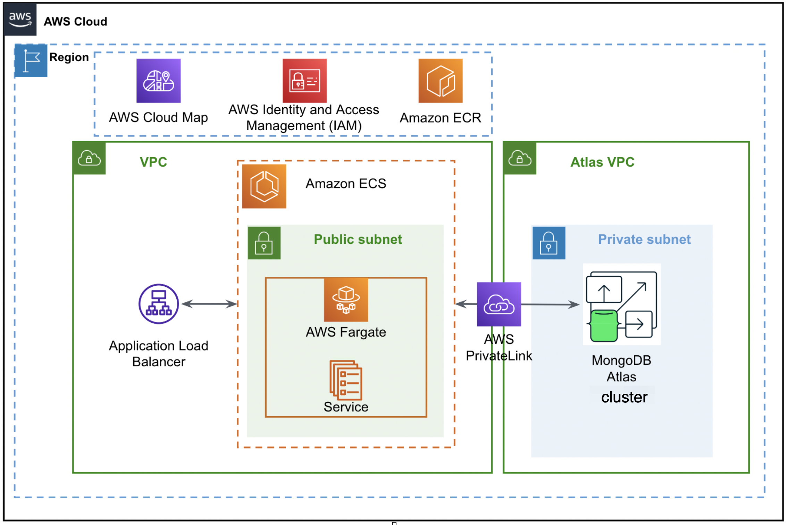

## quickstart-mongodb-atlas-mean-stack-aws-fargate-integration—Quick Start

Application Modernization with MongoDB Atlas and AWS Fargate:

This demo demonstrates an end to end serverless application architected to scale for production, using MEAN Stack with Atlas and AWS Fargate services. The MEAN stack application is containerized and deployed to AWS Fargate as a single click deployment. This will benefit the startup enterprises to transform their ideas to an application at ease, secured and at scale.

This Quick Start provisions complete MongoDB Atlas MEAN Stack AWS Fargate deployments through CloudFormation using official MongoDB Atlas AWS CloudFormation Resource Types.

## Architecture



## Prerequisites

- An AWS account with necessary permissions.
- (Optional) AWS CLI installed in your PC if AWS CLI is your preferred tool.
- AWS Network Configuration - vpc id is required 
- A MongoDB account and a pair of MongoDB Cloud Public and Private API keys.
- ECR client and server images


Includes support for:
* MongoDB Atlas Projects
* MongoDB Atlas Clusters
* MongoDB Atlas Database Users via AWS IAM Integration
* VPC Peering
* AWS Fargate

For architectural details, best practices, step-by-step instructions, and customization options, see the deployment guide.

To post feedback, submit feature ideas, or report bugs, use the [Issues](/issues) section of this GitHub repo. If you'd like to submit code for this Quick Start, please review the AWS Quick Start Contributor's Kit.

## Getting Started

### Setup AWS & API Keys

If needed, install the awscli.

```bash
curl "https://awscli.amazonaws.com/awscli-exe-linux-x86_64.zip" -o "/tmp/awscliv2.zip"
unzip /tmp/awscliv2.zip
sudo /tmp/aws/install
MONGOCLI_VERSION="1.7.0"
curl -L "https://github.com/mongodb/mongocli/releases/download/${MONGOCLI_VERSION}/mongocli_${MONGOCLI_VERSION}_linux_x86_64.tar.gz" -o "/tmp/mongocli_${MONGOCLI_VERSION}_linux_x86_64.tar.gz"
tar xzvf "/tmp/mongocli_${MONGOCLI_VERSION}_linux_x86_64.tar.gz" --directory /tmp
cp "/tmp/mongocli_${MONGOCLI_VERSION}_linux_x86_64/mongocli" "~/.local/bin"
~/.local/bin/mongocli --version
```

### Request paramters:

* MongoDB Atlas API Keys
   - Public and Private keys   
* MongoDB Atlas Configuration
   - Organization Id,  Project Name,  Cluster Name,  Cluster Region,
   - Instance size,  Database Name,  Database Username and Password.
* AWS Network Configuration
   - VPC Id 


Make sure to configure each tool properly.

```bash
aws configure
```


### Launch the quickstart stack

The `templates/quickstart_Fargate_V2.yaml` template will
provision a complete MongoDB Atlas MEAN Stack AWS Fargate Deployment for you. Based on your requirement you can select parameters for MongoDBAtlas cluster, database and AWS network confguration. 

This includes the follow resources:
* [MongoDB::Atlas::Project](/cfn-resources/project)
* [MongoDB::Atlas::ProjectIpAccessList](/cfn-resources/project-ip-access-list) 
* [MongoDB::Atlas::Cluster](/cfn-resources/cluster)
* [MongoDB::Atlas::DatabaseUser](/cfn-resources/database-user) 
    * Includes AWS IAM Role Integration 
* AWS Fargate
    * Includes 'ClientTaskExecutionRole' and 'ServerTaskExecutionRole' roles


Please make sure to update the ECR images for client and server applications in `templates/quickstart_Fargate_V2.yaml`.